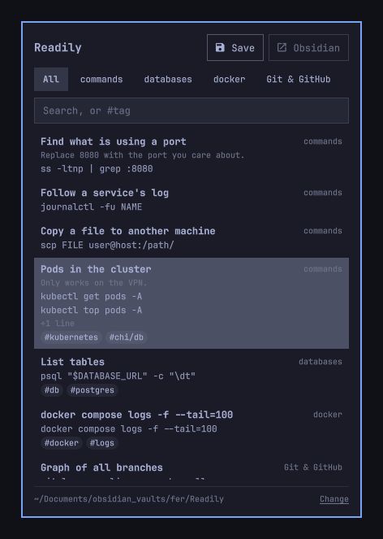
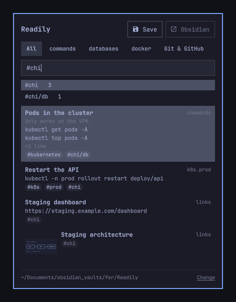
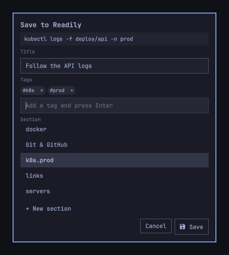

# Readily

Keep the commands, addresses and snippets you never remember in sections you
create, and copy any of them back with one click.



Some things you need every week and still have to look up every time: the
`kubectl` incantation for one project, the tunnel for another, the address of a
staging dashboard, a block of config. The clipboard history loses them, and
tools that sort clippings into links, images and code decide the sections for
you. Readily lets you make your own: `commands`, `servers`, `chi`, whatever
matches how you think about your work. Each section is a plain Markdown note,
so it lives happily inside an Obsidian vault.

## Install

```sh
omarchy plugin add https://github.com/FerC10110/omarchy-readily.git --enable
```

The bar gains a 󰅇 button on the right.

## First run

The first time you open the panel it asks where to keep your sections. It
suggests a `Readily` folder inside each Obsidian vault it finds, plus
`~/Readily`, and you can type any other folder. If the folder has no notes yet,
Readily adds `commands.md` with a few examples so you can see the format.

**Change**, at the bottom of the panel, points Readily at another folder. It
never moves or deletes anything.

## Sections are notes

Every `.md` file directly inside the folder is a section, named after the file.
Every code block or image in it is an item you can copy back. The heading above
it is the title, and the lines between the heading and the block are its
description.

````markdown
---
tags: [chi]
---
## Pods in the cluster
#kubernetes
Only works on the VPN.
```
kubectl get pods -A
```

## Staging dashboard
```
https://staging.example.com/dashboard
```

## Architecture sketch

````

Readily only reads these notes and adds to the end of them. Edit, reorder or
delete items in Obsidian or any text editor; the panel shows the change the next
time it opens.

How notes are read:

- Code blocks can use ` ``` ` or `~~~`, longer fences, and info strings. A block
  without a closing fence runs to the end of the note; saving to that note
  closes it first, so the new item stays out of it.
- An item without a heading takes its first line as the title.
- Several blocks under one heading share that heading as their title.
- Images can be ``, relative to the note, or Obsidian's
  `![[name.png]]`, looked up in the folder and then in the vault. Remote images
  are ignored, and so is any path that leads outside the vault.
- Everything else (paragraphs with no block after them, lists, inline code) is
  left alone.

## Tags

Sections say what kind of thing an item is; tags say what it belongs to. Tag the
commands, links and screenshots of one project with `#chi`, and one search shows
all of them, whatever section they are in.



They are ordinary Obsidian tags, so Obsidian lists them in its tag pane too:

- A tag line under the heading (`#kubernetes #chi/db`), a tag at the end of the
  heading, or a tag inside a description tags that item. Headings read as in
  Obsidian, so a title saved as `Deploy #chi` comes back as `Deploy` tagged
  `#chi`, and `Learn C #` as `Learn C`.
- `tags:` in a note's frontmatter tags every item in the note. The panel shows
  those tags dimmer.
- Nested tags work as in Obsidian: filtering by `#chi` also finds `#chi/db`.
- Tags are case-insensitive and shown in lowercase. `#123` is not a tag, and
  nothing inside a code block is read as one.

## Saving and copying back



Copy something, open the panel and press **Save** (`Ctrl+S`). The form shows
what is on the clipboard and asks for:

- **Title**, optional. Text defaults to its first line, images to the date.
- **Tags**, optional. They start with the tags you are filtering by, or the
  ones you used last time.
- **Section**: pick one, or **+ New section** to create it. New section names
  use letters, digits, spaces, `-` and `_`, and cannot differ from an existing
  one only in case; notes already in the folder keep whatever name they have.

Text is saved exactly as copied, except for trailing line breaks, so pasting a
saved command into a terminal never runs it on its own. Images go to
`attachments/` next to the notes.

To copy an item back, click it or select it and press `Enter`. The panel closes
and the item is on the clipboard, ready to paste. Readily does not paste for you.

### Keys

In the list:

| Key | Action |
|---|---|
| typing | search titles, descriptions and content; words starting with `#` filter by tag |
| `↑` `↓` | move the selection, or through tag suggestions |
| `Enter` | copy the selected item and close, or complete the suggested tag |
| `Tab` | complete the suggested tag |
| `Ctrl+Tab` / `Ctrl+Shift+Tab` | next / previous section |
| `Ctrl+S` | save what is copied |
| `Ctrl+O` | open the section in Obsidian, or in your default app outside a vault |
| `Esc` | clear the search; close when it is already empty |

While saving:

| Key | Action |
|---|---|
| `Enter` | save; in the tags field, add the typed tag first |
| `Space` or `,` | in the tags field, add the typed tag |
| `Backspace` | in an empty tags field, remove the last tag |
| `↑` `↓` | choose the section |
| `Tab` | move between title, tags and the new section name |
| `Esc` | back to the list |

## A key for it

The panel answers two commands, so a keybinding can open the list or go straight
to saving. First check that the keys are free (no output means nobody uses them):

```sh
hyprctl -j binds | jq '.[] | select(.modmask == 72 and ((.key | ascii_upcase) == "V" or (.key | ascii_upcase) == "C"))'
```

`72` is `SUPER + ALT`. Then add to `~/.config/hypr/bindings.lua`:

```lua
o.bind("SUPER + ALT + V", "Readily", "omarchy-shell io.github.ferc10110.readily toggle")
o.bind("SUPER + ALT + C", "Save to Readily", "omarchy-shell io.github.ferc10110.readily save")
```

`open` and `close` are available too.

## From the terminal

The engine behind the panel is a Python script that works on its own. Put it on
your `PATH`:

```sh
ln -s ~/.config/omarchy/plugins/io.github.ferc10110.readily/bin/readily ~/.local/bin/
```

```sh
readily list                         # every section and item, with the index copy needs
readily list --tag chi               # only items tagged #chi (or #chi/...)
readily tags                         # every tag and how many items have it
readily save commands --title "Pods" --tag chi   # save what is copied
some-command | readily save commands --stdin --create --tag chi
readily copy commands 3 HASH         # HASH comes from `readily list --json`
readily open commands                # open the note in Obsidian
readily where                        # which folder is used and why
readily init ~/Notes/Readily         # use another folder
```

Every command takes `-h`, and `list`, `tags`, `where`, `vaults` and `peek` take
`--json`.

## Configuration

| Variable | Default | What it does |
|---|---|---|
| `READILY_DIR` | the folder you chose | Use this folder instead, for this process only. While it is set, choosing another folder (in the panel or with `readily init`) is refused; creating this one works but is not remembered |
| `READILY_MAX_TEXT_BYTES` | `262144` (256 KiB) | Largest text Readily saves |
| `READILY_MAX_IMAGE_BYTES` | `20971520` (20 MiB) | Largest image Readily saves |
| `READILY_CLIP_TIMEOUT` | `2` | Seconds to wait for the app that owns the clipboard |

The folder you choose is stored in `~/.config/readily/config.json`.

## What it does not do

- It does not read, change or clear Omarchy's clipboard history. To save
  something you copied earlier, bring it back with `Super+Ctrl+V` first.
- It does not edit, move or delete items or tags already saved; that happens
  in your notes.
- It does not paste for you.
- It keeps one folder at a time.

## Safety

- Clipboard content is never passed as a command-line argument and no shell is
  involved: it goes through pipes to `wl-paste` and `wl-copy` only.
- Anything a password manager marks as a password is refused, and so is text or
  an image over the size limits. Nothing is ever cut short.
- Saving only appends to a note, through a temporary file renamed into place
  under a lock. If the note changes while saving, Readily reads it again.
- Notes and attachments are only written inside the chosen folder, never
  through a symbolic link, and an existing attachment is never replaced.
  Outside that folder Readily writes only `~/.config/readily/config.json` and
  `$XDG_RUNTIME_DIR/readily`, which holds its lock and a copy of the last
  clipboard image it previewed until the next preview or until you log out.
- Nothing leaves your machine.

## Remove

```sh
omarchy plugin remove io.github.ferc10110.readily
```

Your notes stay where they are. `~/.config/readily/` holds only the folder
setting and can be deleted.

## Development

```sh
PYTHONDONTWRITEBYTECODE=1 python3 -m unittest discover -s tests -v
node --test tests/model.test.js
omarchy plugin validate .
```

The tests use a temporary home and fake `wl-paste`/`wl-copy`, so they never
touch your clipboard or your notes.

## License

MIT
